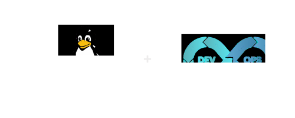

# Linux for Devops

  
  &nbsp;&nbsp;&nbsp;&nbsp;

## Descrição

### Este repositório reúne o conhecimento essencial de Linux para quem deseja atuar como DevOps no dia a dia.

> Aqui você encontrará resumos objetivos dos meu estudos sobre Linux, exemplos práticos e comandos úteis, organizados por tópicos e fases de aprendizado, para facilitar estudos e consultas rápidas durante o trabalho.

Conteudo

- ## [Fase-1](content/fase-1/fhs/README.md#o-que-é-o-fhs)
  #### Estrutura de diretórios do Linux (FHS)
  - [1. O que é o FHS](content/fase-1/fhs/README.md#o-que-é-o-fhs)
  - [2. Principais diretórios e suas funções](content/fase-1/fhs/README.md#principais-diretórios-e-suas-funções)
  - [3. Por que o DevOps precisa conhecer o FHS](content/fase-1/fhs/README.md#por-que-o-devops-precisa-conhecer-o-fhs)
  - [4. Exemplos práticos de uso](content/fase-1/fhs/README.md#exemplos-práticos-de-uso)
  - [5. Boas práticas para DevOps](content/fase-1/fhs/README.md#boas-práticas-para-devops)
  - [6. Dicas rápidas de administração](content/fase-1/fhs/README.md#dicas-rápidas-de-administração)
  - [Resumo rápido para consultas](content/fase-1/fhs/README.md#resumo-rápido-para-consultas)
  #### Permissões de arquivos/diretorios
  - [1. Conceito geral](content/fase-1/permissoes/README.md#conceito-geral)
  - [2. Interpretação de Permissões](content/fase-1/permissoes/README.md#interpretação-de-permissões)
  - [3. Alterando Permissões (chmod)](content/fase-1/permissoes/README.md#alterando-permissões-chmod)
  - [4. Alterando Owner e Group (chown/chgrp)](content/fase-1/permissoes/README.md#alterando-owner-e-group-chown-chgrp)
  - [5. Permissões Especiais](content/fase-1/permissoes/README.md#permissões-especiais)
  - [6. Umask (Permissões Padrão)](content/fase-1/permissoes/README.md#umask-permissões-padrão)
  - [7. Boas Práticas DevOps](content/fase-1/permissoes/README.md#boas-práticas-devops)
  - [8. Dicas rápidas](content/fase-1/permissoes/README.md#dicas-rápidas)
  - [9. Alterando as configurações padrão do Umask no Ubuntu](content/fase-1/permissoes/README.md#alterando-as-configurações-padrão-do-umask)
  - [10. Resumo rápido](content/fase-1/permissoes/README.md#resumo-rápido)
  ### Gerenciamento de Processos no Linux
  - [O que é um Processo](content/fase-1/processos/README.md#o-que-é-um-processo)
  - [Sinais de Processos (Signals)](content/fase-1/processos/README.md#sinais-de-processos-signals)
  - [Comandos para Listar Processos](content/fase-1/processos/README.md#comandos-para-listar-processos)
  - [Filtrando Processos](content/fase-1/processos/README.md#filtrando-processos)
  - [Monitoramento em Tempo Real](content/fase-1/processos/README.md#monitoramento-em-tempo-real)
  - [Finalizando Processos](content/fase-1/processos/README.md#finalizando-processos)
  - [Boas Práticas DevOps](content/fase-1/processos/README.md#boas-práticas-devops)
  - [Dicas rápidas](content/fase-1/processos/README.md#dicas-rápidas)
  - [Resumo rápido](content/fase-1/processos/README.md#resumo-rápido)
  ### Gerenciamento de Inicialização e Serviços com systemd + systemctl
  - [O que é o systemd](content/fase-1/systemd_systemctl/README.md#o-que-é-o-systemd)
  - [O que é o systemctl](content/fase-1/systemd_systemctl/README.md#o-que-é-o-systemctl)
  - [Comandos mais usados no dia a dia DevOps](content/fase-1/systemd_systemctl/README.md#comandos-mais-usados-no-dia-a-dia-devops)
  - [Pontos importantes para DevOps](content/fase-1/systemd_systemctl/README.md#pontos-importantes-para-devops)
  - [Boas Práticas DevOps com systemd](content/fase-1/systemd_systemctl/README.md#boas-práticas-devops-com-systemd)
  - [Resumo rápido para consultas](content/fase-1/systemd_systemctl/README.md#resumo-rápido-para-consultas)
- ## Fase-2 - Em andamento
- ## Fase-3 - Em andamento
- ## Fase-4 - Em andamento
